# ProjectTower

名作『SimTower』をリスペクトした、2Dサイドビューのビル経営シミュレーションです。
テナントを建ててビルを大きくしながら、エレベーターを工夫して住人の待ち時間（ストレス）を減らし、ビルの評価（★）を上げていきます。

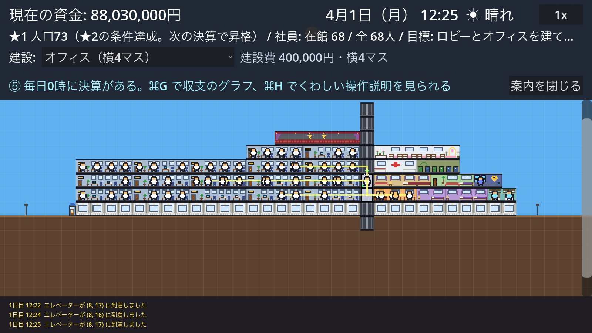
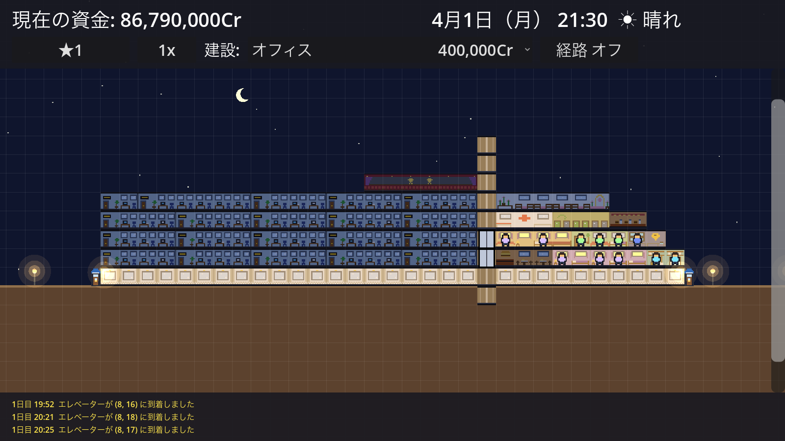

## 目次

- [開発環境の構築](#開発環境の構築)
- [アプリの実行方法](#アプリの実行方法)
- [配布（書き出し）](#配布書き出し)
- [遊び方（マニュアル）](#遊び方マニュアル)
  - [画面の見方](#画面の見方)
  - [操作方法](#操作方法)
  - [1日の流れ](#1日の流れ)
  - [演出](#演出)
  - [音](#音)
  - [収支のグラフ](#収支のグラフ)
  - [セーブと読み込み](#セーブと読み込み)
  - [天気](#天気)
  - [カレンダーとサンタクロース](#カレンダーとサンタクロース)
  - [はじめての案内](#はじめての案内)
  - [目標（シナリオ）](#目標シナリオ)
  - [タイトル画面](#タイトル画面)
  - [昼と夜](#昼と夜)
  - [建てられるもの](#建てられるもの)
  - [人の種類](#人の種類)
  - [人の気持ち（ストレス）](#人の気持ちストレス)
  - [騒音（ノイズ）](#騒音ノイズ)
  - [埋蔵金の発見](#埋蔵金の発見)
  - [ゴキブリの大繁殖](#ゴキブリの大繁殖)
  - [火災](#火災)
  - [爆破予告（テロ）](#爆破予告テロ)
  - [VIPの宿泊（★4への昇格イベント）](#vipの宿泊4への昇格イベント)
  - [衛生の悪化](#衛生の悪化)
  - [テナントの評価と退去](#テナントの評価と退去)
  - [エレベーター](#エレベーター)
  - [お金（毎日の決算）](#お金毎日の決算)
  - [ビルの評価（★）](#ビルの評価)
- [ファイル構成](#ファイル構成)
- [開発の進め方](#開発の進め方)

---

## 開発環境の構築

### 必要なもの

| もの | バージョン | 用途 |
|---|---|---|
| [Godot Engine](https://godotengine.org/) | 4.7（4.7.2 で動作確認） | ゲームエンジン（エディタと実行） |
| Git | 何でもよい | ソースコードの取得 |

画像ファイルや追加のアセットは不要です。建物・人のドット絵やUIは、すべてGDScriptのコードで作っています。

### 手順（macOS）

1. **Godot をインストールする**

   Homebrew を使う場合:

   ```bash
   brew install --cask godot
   ```

   または [Godot の公式サイト](https://godotengine.org/download) から「Godot Engine 4.7（標準版）」をダウンロードして、アプリケーションフォルダに入れます。
   コマンドラインから `godot` を使えるか確かめます:

   ```bash
   godot --version
   ```

2. **ソースコードを取得する**

   ```bash
   git clone git@github.com:Toshiaki0315/ProjectTower.git
   ```

3. **Godot エディタでプロジェクトを開く**

   Godot を起動し、プロジェクトマネージャーの「インポート」から、取得したフォルダの `project.godot` を選びます。
   初回はエディタが画像などの読み込み（インポート）を行うので、少し待ちます。

## アプリの実行方法

### Godot エディタから

プロジェクトを開いて **F5**（または右上の ▶ ボタン）を押すと、ゲームが始まります。

### コマンドラインから

```bash
godot --path .
```

（`ProjectTower` フォルダの中で実行します）

### 自動テスト（画面確認テスト）

実際のクリック操作を再現して、建設・移動・エレベーター・収支などを確かめ、各場面のスクリーンショットを保存します。

いくつかの組に分けて並べて実行すると速く終わります（既定は3組で2分半ほど。1組だけなら5分ほど）。

```bash
tools/run_tests.sh
```

分ける数は引数で変えられます（例: `tools/run_tests.sh 4`）。分けすぎると1つあたりの描画が遅くなり、早送りに人の動きが追いつかなくなります。

一部のシナリオだけ流すときは、`TEST_ONLY` に関数名の一部を指定します（例: `TEST_ONLY=express`）。
テスト中のウィンドウはマウスを受け付けないので、そのまま待ちます。

```bash
godot --path . -s res://tests/screenshot_test.gd -- /tmp/projecttower_screens
```

最後に `RESULT: ALL PASSED` と出れば成功です。`--` の後ろはスクリーンショットの保存先です（省略すると Godot のユーザーデータフォルダに保存）。

### README の画像を作り直す

ドット絵を変えたときは、次のコマンドで `docs/images/` の画像を作り直せます。

```bash
godot --path . -s res://tools/generate_readme_images.gd
```

---

## 遊び方（マニュアル）

### 画面の見方

- **上部バー（1段目）:** 資金（前日の収支）、日付・曜日・時刻、天気
- **上部バー（2段目）:** ★（押すとビルのくわしい状況）、速度ボタン（押すたびに 1x → 4x → 16x）、建設メニュー、動線の表示
  - 火事や爆破予告などの知らせがあるときは、★の横に **⚠と件数**が出ます。★を押すと中身が読めます
- **マップ:** ビルの断面図です。空の色は時刻とともに変わり、昼は太陽、夜は月と星が出ます（[昼と夜](#昼と夜)）。1階の床より下は地下（土）です
- **右端:** 上下のスクロールバー
- **下部バー:** 操作の結果や決算などのメッセージ（3行。古いものは上へ流れます）
- **吹き出し:** 建物や人にカーソルを合わせると、その場に出ます

### はじめての案内

はじめて遊ぶときは、上部バーの下に案内が1行ずつ出ます。そのとおりに進めると、次の案内に変わります。

1. 1階にロビーを建てる
2. エレベーターか階段で、上の階へ行けるようにする
3. 2階から上にオフィスを建てる
4. 速度ボタンで時間を進めて、社員の出勤を見る
5. 決算を見る（⌘G の収支のグラフ、F1 の操作説明）

いつでも「案内を閉じる」でやめられます。進み具合はセーブに入ります。

### 目標（シナリオ）

ゲームには4つの目標があり、上から順に1つずつ挑戦します。今の目標は上部バーに「目標: 30日目までに★3（あと12日）」のように出ます。

| # | 目標 |
|---|---|
| 1 | ロビーとオフィスを建てて、人口50人と★2をめざそう（期限なし） |
| 2 | 45日目までに★3（人口120・メディカルセンター・ゴミ処理場） |
| 3 | 90日目までに★4（人口250・地下鉄駅・VIPの宿泊） |
| 4 | 120日目までに資金5,000万Crをためよう |

達成すると画面で知らせ、次の目標に進みます。すべて達成するとクリアの画面が出て、その後は好きなだけビルを大きくできます。**期限を過ぎてもゲームオーバーにはならず**、遅れて達成しても大丈夫です。

### タイトル画面

起動するとタイトル画面が出ます。

- **はじめから**: 更地・資金200万Crでゲームを始めます。
- **続きから**: ⌘S で保存したセーブデータを読み込んで続きを遊びます（セーブデータがないときは押せません）。
- タイトル画面の間は時間が止まっていて、マップも操作できません。

「はじめから」を押すと、資金200万Crで、1日目（4月1日・月曜日）の7:30に、建物が何もない**更地**から始まります。地面の線が1階の床で、その下は地下です。

**はじめの一歩**
1. 建設メニューで「ロビー」を選び、1階（地面の線のすぐ上の段）をクリックして横に並べます。ロビーの左端が入口になり、人はここから出入りします。
2. 「エレベーター」をロビーの隣の1階から上へ縦に並べるか、「階段」を置いて、上の階へ行けるようにします。
3. 2階から上に、オフィスやホテルなどのテナントを建てます（1階はロビー専用なので、テナントは建てられません）。

### 操作方法

| 操作 | やり方 |
|---|---|
| 建てる | 上の「建設」メニューで選び、マップを左クリック（クリックしたマスが建物の左端） |
| 撤去する | 建物のどこかを右クリック（建物ごと撤去）。**撤去費用がかかります**（建設費の1割・最低2,000Cr。建設費は戻りません）。建設メニューの「撤去」を選べば左クリックでも撤去できる |
| 建て替える | 建物の上に直接ほかの建物は建てられません。**先に撤去して**から建てます（空きフロアの上には、そのまま建てられます） |
| 続けて建てる・撤去する | マウスのボタンを押したままなぞる（ロビーやエレベーターを一気に伸ばせる） |
| 上下スクロール | マウスホイール / 右端のスクロールバー / W・S・↑・↓ キー |
| 左右スクロール | Shift + マウスホイール / A・D・←・→ キー |
| ズーム | Ctrl（⌘）+ マウスホイール / トラックパッドのピンチ |
| カメラを動かす | トラックパッドの2本指スクロール / マウスの中ボタンでドラッグ |
| 時間の速さ | 上部バーの★の右にある速度ボタン（押すたびに 1x → 4x → 16x → 1x と切り替わり、今の速度が出る） |
| 建てるものを選ぶ | 上部バーの「建設」メニュー（名前と建設費が出る。大きさはカーソルの枠でわかり、くわしい説明はメニューにカーソルを合わせると出る） |
| ビルのくわしい状況 | 上部バーの★を押す（人口・次の★の条件・目標・社員・オフィス・客室。気をつけることがあるときは★の横に ⚠ と件数が出る） |
| メニュー | 画面いちばん上のメニューバー（ファイル・表示・ゲーム・ヘルプ）。下記のほとんどの操作はここからも選べる |
| 動線（人の通り道）の表示 | R または「建設」の行の右にある「動線」ボタン（既定はオフ） |
| 操作説明の開閉 | F1 または H |
| 開いているパネルを閉じる | Esc（操作説明・メッセージの記録・収支のグラフ） |
| メッセージの記録 | ⌘L（ゲーム開始からのメッセージを時刻つきで表示） |
| 画面の拡大・縮小 | ⌘+ / ⌘-（⌘0 でもとの大きさに戻る） |
| セーブ | ⌘S（ビル・資金・日付・評価・設備の状態を保存） |
| セーブデータの読み込み | ⌘O（保存したところから続きを遊ぶ） |
| 収支のグラフ | ⌘G（最近60日ぶんの決算を棒グラフで表示） |
| 音のオン・オフ | M |
| エレベーターを呼ぶ | 「エレベーター」（急行なら「急行エレベーター」）を選んだ状態で、シャフトのマスをクリック |
| カゴを増やす | 「カゴ追加」を選んで、シャフトのマスをクリック |
| 住人を動かして試す | 「住人（テスト）」を選び、建物をクリックで住人を置き、行き先をクリック |

カーソルを置くと、建てるマスが緑（建てられる）か赤（建てられない）で表示されます。

画面の見方は次のとおりです。
- **上部バー:** 1段目が資金・日付と時刻、2段目が★・速度・建設メニュー・動線
- **下部バー:** 操作の結果のメッセージ3行（小さめの黄色い文字。新しいものが下に出て、古いものは上へ流れます）と、一番下にカーソルを置いたマスの情報（何階か・マスの座標・建物の種類と状態）
- 流れて消えたメッセージは、**⌘L** でいつでも見返せます。

### 1日の流れ

ゲーム内の1時間は、1x で現実の30秒です。1日目は月曜日で、土日は休日です。

| 時刻 | 平日 | 休日（土日） |
|---|---|---|
| 7:00〜9:00 | 住宅の家族が出かける | |
| 7:00〜10:00 | ホテルの客がチェックアウト（部屋は清掃待ちに） | 同じ |
| 8:00〜9:00 | 社員が出勤（朝のラッシュ） | オフィスは休み |
| 10:00〜12:00 | | 住宅の家族が出かける |
| 10:00〜13:00 | | 結婚式（来客12人） |
| 12:00〜13:30 | 社員が飲食店かファストフードで昼食（昼のラッシュ） | |
| 13:00〜17:00 | | イベント（来客15人） |
| 15:00〜18:00 | | 住宅の家族が帰ってくる |
| 17:00〜18:00 | 社員が退社（夕方のラッシュ） | |
| 17:00〜20:00 | 住宅の家族が帰ってくる | |
| 17:00〜21:00 | ホテルに客がチェックイン | 同じ |
| 0:00 | 前日の決算（収支が資金に反映） | 同じ |

人はビルの**入口**から出入りします。入口はロビー（地下鉄駅）の左隣に、マスの半分の幅の小さなアイコン（庇の付いた両開きの扉）で表示されます。庇の色は1階の入口が青、地下鉄駅が水色です。人は近い方の入口を使います。入口からたどり着けない建物には人が来ません。

### 演出

- **歩く人:** 人は歩いている間、足を交互に動かします。
- **建てたとき:** 白い枠がふわっと広がります。
- **撤去したとき:** 土ぼこりが上がります。
- **決算で黒字のとき:** 入口のあたりに「+424,000Cr」の文字が浮かび上がります。

### 音

効果音とBGMは、**音の波形をゲームの中で作っています**（音源ファイルは持っていません。ドット絵と同じ考え方です）。

| 音 | いつ鳴るか |
|---|---|
| 建設・撤去 | 建物を建てたとき・撤去したとき |
| チャイム | エレベーターが階に着いたとき |
| コインの音 | 毎日の決算のとき |
| 警報 | 爆破予告・火事が起きたとき |
| ブザー | 建てられない・撤去できないとき |

BGMはゆっくりした和音のくり返しで、**昼と夜で和音が変わります**。**M** キーで音を消したり戻したりできます。

### 収支のグラフ

**⌘G** で、最近60日ぶんの決算を棒グラフで見られます。

- 0Crの線より上（緑）が黒字、下（赤）が赤字です。棒の高さは、その期間の一番大きい額に合わせて伸び縮みします。
- 下に、いちばん新しい決算の内わけ（賃料・宿泊・飲食・ショップ・映画館・維持費・ゴミ…）が出ます。

### セーブと読み込み

**⌘S** で今のビルを保存し、**⌘O** で読み込んで続きから遊べます（保存先は Godot のユーザーデータのフォルダの `save.json` です）。

保存されるのは、建物の配置・資金・日付と時刻・ビルの評価（★）・VIPの合否・エレベーターの設定（カゴの数・待機階・稼働時間帯）・テナントの評価・客室と住宅の状態・衛生の悪化・ゴキブリ・掘った地下のマスです。歩いている人は保存されず、読み込んだ後にまた出てきます。

### 天気

天気は日ごとに決まります（**晴れ・くもり・雨**）。上部バーの時刻の右に「☂ 雨」のように出ます。

- **雨の日**は、入口から歩いて来る店のお客さんが**半分**になります。空が暗くなり、雨が降ります。
- **地下駐車場**から来るお客さんは濡れないので、雨でも減りません。雨の日の売上を支えたいなら、駐車場が効きます。
- **6月は梅雨**で、雨の日がぐっと増えます。
- くもりの日は、空が少し暗くなるだけです。

### カレンダーとサンタクロース

ゲームは**4月1日（月）**から始まり、上部バーに「12月24日（火） 22:30」のように日付と時刻が出ます。1年は365日（うるう年なし）で、3月31日の次はまた4月1日です。

**12月24日・25日の21時〜24時**には、サンタクロースのソリが夜空を左から右へ横切ります（見つけたらラッキーです）。

### 昼と夜

背景の空は時刻とともに少しずつ色が変わるので、空を見ればおおよその時刻がわかります。

| 時刻 | 空 |
|---|---|
| 深夜（22時〜4時半） | 紺。月と星が出る |
| 早朝〜朝焼け（5時半〜6時半） | 紫から桃色。太陽が左から昇る |
| 朝〜昼 | 水色から青。昼の12時に太陽が一番高くなる |
| 夕方（17時半ごろ） | オレンジ。太陽が右へ沈む（18時半） |
| 夕暮れ〜夜 | 紫から紺。月が昇る |

暗くなるとビルも暗くなり、次の場所にだけ明かりが灯ります。

- 人がいる部屋（席にいる社員のオフィス、宿泊客のいる客室、家にいる人の部屋、客がいる飲食店・会場）
- 一晩中灯っている場所（階段・エレベーター・設備）
- ビルの外の地面に4マスおきに立つ街灯と、入口の照明

### 建てられるもの

建物はそれぞれ横に何マスかの大きさがあり、クリックしたマスを左端に建ちます。上下の階は、**階段**・**エスカレーター**・**エレベーター**でつながないと行き来できません。

**メニューバー:** macOSでは画面のいちばん上（アプリのメニューバー）に「ファイル・表示・ゲーム・ヘルプ」が出ます。ショートカットを覚えていなくても、ここからマウスで選べます。今オンになっている項目（動線・音・開いているパネル）にはチェックマークが付きます。

| メニュー | 中身 |
| --- | --- |
| ファイル | セーブ / セーブデータの読み込み |
| 表示 | 動線 / メッセージの記録 / 収支のグラフ / 拡大・縮小・もとの大きさ |
| ゲーム | 速さを切り替える / 音を出す |
| ヘルプ | 操作説明 |

**焼け跡:** 火事で焼け落ちたり、爆発で吹き飛んだりした部屋は、**黒焦げの焼け跡**になります。上の階は支えたままなので浮きませんが、焼け跡の上にはそのまま建てられません。**撤去（1マス2,000Cr）**してから建て直します。上に建物が残っていれば、撤去したあとは空きフロアになります。

**動線の表示:** 「動線」ボタン（Rキー）を押すと、今ビルの中を移動している人の**通り道**が線で出ます。行き先には小さな四角が付きます。線の色は、その人の種類の色（社員は白、宿泊客は紫…）と同じです。人が増えると画面が線だらけになるので、既定はオフです。**見た目だけの機能**で、経路探索や人の動きには影響しません。

**空きフロア:** 骨組みだけのフロアです。建物の大きさが合わずに**すき間が1マス空いてしまったとき**、そこに空きフロアを建てれば、上の階を建てられるようになります（建設メニューの「ロビー・移動」にあります。1万Cr）。

**上の階に建物が残っているマスを撤去したときにも、建物の代わりに空きフロアが残ります**（そうしないと上の部屋が空中に浮いてしまうため）。上の階はそのままなので、低い階のテナントだけを入れ替えられます。空きフロアは通り抜けでき、その上から別の建物をそのまま建て直せます。上に何もなくなれば、撤去で更地に戻ります。

**建てられる階の決まり:** 1階はロビー専用で、1階に建てられるのはロビー・階段・エレベーターだけです。地下鉄駅は地下5階より深いところにだけ、スカイロビーは15階・30階・45階…にだけ建てられます。それ以外の建物は、2階から上か地下に建てます。何階かは、カーソル下のマスの情報（下部バーの右）の先頭に出ます。

**ビルの大きさの上限:** 地上150階・地下50階（合わせて200階）まで、横は100マス（マスのx座標で -50〜49）までです。上限を超えるマスは赤く表示され、クリックすると理由が出ます。

**建物の支え:** 建物は宙に浮かせられません。2階から上の建物は、建てるマスの真下が全部ほかの建物で埋まっている必要があります（1階から上へ積み上げていきます）。地下は、真上に建物がある場所にだけ建てられます（1階から下へ掘り進めます）。上に建物が残っているマスを撤去すると、「空きフロア」が残ります（下記）。更地に戻したいときは、上の階から（地下は下の階から）順に撤去します。エレベーターのシャフトも同じく、1階から積み上げ、上のマスから撤去します。

#### テナント（収入になる建物）

| 絵 | 名前 | 大きさ | 建設費 | 内容 |
|---|---|---|---|---|
| 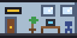 | 小さいオフィス | 横2マス | 24万Cr | 社員が2人。賃料は1マス1日**1.1万Cr**。狭いすき間に入るが、1マスあたりは割高 |
| 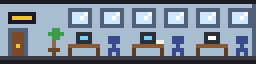 | オフィス | 横4マス | 40万Cr | 社員が4人（1マスに1人）。平日8〜9時に出勤し、17〜18時に退社。昼は飲食店かファストフードへ。賃料は1マス1日1万Cr（休日も入る。空室の間は入らない） |
| 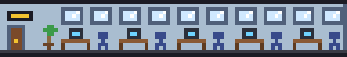 | 大きいオフィス | 横6マス | 48万Cr | 社員が6人。賃料は1マス1日**0.9万Cr**。まとめ借りで1マスあたりは割安だが、6人ぶんの人がエレベーターに乗る |
| 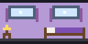 | シングル | 横2マス | 15万Cr | 17〜21時に客1人が泊まり、翌朝チェックアウトで宿泊料2万Cr。清掃20分 |
| 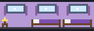 | ツイン | 横3マス | 20万Cr | 客2人。宿泊料3.5万Cr。清掃30分 |
|  | スイート | 横4マス | 50万Cr | 客2人。宿泊料8万Cr。清掃45分 |
|  | 飲食店 | 横3マス | 20万Cr | 平日12〜13時に社員が一番近い店で昼食（30分）。売上は1人1,000Cr。外からのお客さんも来る（平日2人・休日8人） |
| 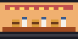 | ファストフード | 横2マス | 12万Cr | 飲食店の小さくて速い版。食事は10分、売上は1人600Cr。狭い場所に置けて、昼の混雑をさばける。外からのお客さんも来る（平日3人・休日10人） |
| 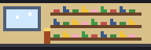 | ショップ | 横3マス | 25万Cr | 外からのお客さんが買い物に来る（平日3人・休日10人、1人1,500Cr、滞在20分）。社員は来ない（維持費 3,000Cr/日） |
| 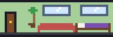 | 住宅 | 横3マス | 40万Cr | 3人家族が入居すると販売収入70万Cr（1回だけ）。家族は毎日出かけて帰ってくる |
| 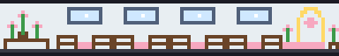 | 結婚式場 | 横6マス | 100万Cr | 休日の10〜11時に来客12人、13時まで。1人1万Cr |
| 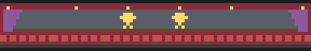 | イベントホール | 横6マス | 80万Cr | 休日の13〜14時に来客15人、17時まで。1人3,000Cr |
| 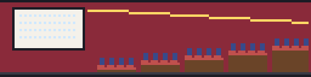 | 映画館 | 横8マス・高さ2階分 | 150万Cr | 上映時刻に客が一斉に来て、2時間後に一斉に帰る（1人1,800Cr）。平日は13時・16時・19時、休日は11時・14時・17時・20時。1回の客は平日10人・休日16人で、使える駐車場の台数ぶん増える（最大8人）。人が歩くのは下の階だけ（維持費 2万Cr/日） |

ホテルの客室は、チェックアウトすると「清掃待ち」（茶色の汚れ）になり、清掃が済むまで次の客は泊まれません。**ハウスキーパー室**を建てておきましょう。

#### ロビー・移動（上下の階をつなぐ）

| 絵 | 名前 | 大きさ | 建設費 | 内容 |
|---|---|---|---|---|
| 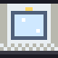 | ロビー | 1マス | 1.5万Cr/マス | 1階専用。1マスずつ横に伸ばせる。左端が入口になる（一晩中明かりが灯る） |
| 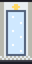 | 吹き抜けロビー（2階分） | 1マス・高さ2階分 | 3万Cr/マス | 天井の高いロビー。上の階には床がないので、人が歩くのは1階だけ |
| 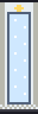 | 吹き抜けロビー（3階分） | 1マス・高さ3階分 | 4.5万Cr/マス | 同じく3階分の高さ |
| 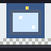 | スカイロビー | 1マス | 5万Cr/マス | 15階・30階・45階…にだけ建てられる乗り換え専用のフロア。1マスずつ横に伸ばせる（入口にはならない） |
| 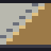 | 階段 | 1マス | 5万Cr | そのマスと1つ上の階をつなぐ。縦に積めば何階でも行ける。近い階の移動向き |
| 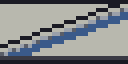 | エスカレーター | 横2マス | 10万Cr | 左のマス（乗り口）から、1つ上の階の右のマスへ斜めに上がる（下りにも使える）。待ち時間も定員もなく、階段より楽で速い。降り口に次のエスカレーターを建てると乗り継げる（維持費 2,000Cr/日） |
| 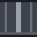 | エレベーター | 1マス | 8万Cr/マス | 縦に並べたマスが1本のシャフトになり、カゴが1台できる。遠い階の移動向き（維持費 2,000Cr/マス/日） |
|  | 大型エレベーター | 横2マス | 24万Cr/階 | **全部の階に停まる**大きなエレベーター。カゴは標準の1.5倍の速さで定員16人（維持費 3,000Cr/階/日）。中くらいの階の混雑をさばくのに向く |
| 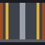 | 急行エレベーター | 1マス | 12万Cr/マス | 1階とスカイロビーの階（15階・30階…）にだけ停まる。途中の階では乗り降りできない。カゴは標準の3倍の速さで定員20人（維持費 3,000Cr/マス/日） |
| 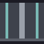 | サービスエレベーター | 1マス | 8万Cr/マス | 裏方専用のエレベーター。清掃員だけが乗れて、社員や客は乗れない。客室と裏方の動線を分けると、普通のエレベーターが空く（維持費 1,500Cr/マス/日） |
| 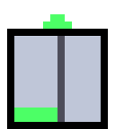 | カゴ追加 | － | 5万Cr/台 | シャフトにカゴを増やす（1本に4台まで。維持費 3,000Cr/台/日） |
| － | 待機階を設定 | － | 無料 | シャフトのマスをクリックすると、その階が待機階になる。呼び出しがないとカゴはその階に戻って待つ（黄色い印が付く。もう一度クリックで解除） |
| － | 稼働時間帯 | － | 無料 | シャフトのマスをクリックするたびに、終日 → 6時〜24時 → 8時〜20時 と切り替わる。時間帯の外ではカゴを呼べず、人の経路にも使われない |

人は移動の手間（歩く距離・階段・エスカレーター・エレベーターの待ち時間）を比べて、一番楽な経路を選びます。1〜2階の移動なら階段かエスカレーター、それより遠い階ならエレベーターを使うことが多くなります。エスカレーターは待たずに何人でも乗れるので、人の多い低い階（飲食店など）の移動に向いています。

#### 設備

| 絵 | 名前 | 大きさ | 建設費 | 維持費/日 | 内容 |
|---|---|---|---|---|---|
| 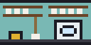 | ハウスキーパー室 | 横2マス | 20万Cr | 1万Cr | 清掃員が2人。清掃待ちの客室を近い順に掃除する |
| 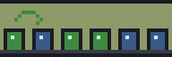 | ゴミ処理場 | 横3マス | 15万Cr | 5,000Cr | 1施設で1日20のゴミを処理。足りない分は外部委託（1につき1,000Cr）。足りない日が続くとビルが汚れる |
| 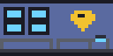 | 警備室 | 横2マス | 10万Cr | 5,000Cr | 警備員が1人常駐し、爆弾の解体と消火に向かう。★2にも必要 |
| 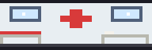 | メディカルセンター | 横3マス | 20万Cr | 1万Cr | ビル全体のストレスの回復が速くなる（1施設で1.5倍、増やすほど速く、最大2.5倍）。★3にも必要 |
| 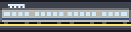 | 地下鉄駅 | 横4マス | 100万Cr | 1万Cr | **地下5階より深いところ**にだけ建てられる。2つ目の入口になり、店・映画館のお客さんが1駅につき5割増える（最大2倍）。★4にも必要 |
| 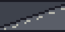 | スロープ | 横2マス | 20万Cr | 2,000Cr | 車が下りてくる道。地下1階のスロープが1階からの入口で、その真下の階にもスロープを建てると、さらに下の階まで車で下りられる |
| 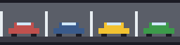 | 地下駐車場 | 横4マス | 30万Cr | 5,000Cr | 1棟に4台。地下の何階にでも建てられるが、**同じ階**のスロープまで行ける駐車場だけが使える（車は階段では下りられない） |
| 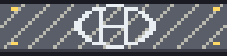 | ヘリポート | 横4マス | 80万Cr | 1万Cr | 屋上（上に建物がないところ）にだけ建てられる。火事のとき、消防ヘリが飛んできて上の階の火から消す |
| 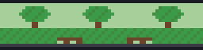 | 屋上庭園 | 横4マス | 40万Cr | 5,000Cr | 屋上にだけ建てられる。ビル全体のストレスの回復が1.3倍になり（最大2.5倍まで重なる）、騒音を3ぶんやわらげる |

**映画館の混雑:** 上映の30分前から客が集まり、終わると一斉に帰ります。短い時間にエレベーターへ人が殺到するので、カゴを増やすか、エスカレーターや階段を近くに用意しておくと安心です。

**外から来るお客さん:** 飲食店・ファストフードとショップには、入口（1階のロビーか地下鉄駅）から外のお客さんが来ます。平日は11〜14時、休日は10〜17時です。休日は社員が来ないぶん、店の稼ぎが頼りになります。店まで歩ける道がないと、お客さんは来ません。

**車で来るお客さん:** 使える駐車場があると、昼（11〜14時）に1台につき2人がやって来て、一番近い飲食店で食事をして帰ります（1人1,000Cr）。駐車場から飲食店まで歩ける道（階段やエレベーター）がないと、誰も来ません。飲食店が1つもない日も来ません。

### 人の種類

服の色で種類がわかります（顔の色はストレスを表します）。カーソルを人のいるマスに合わせると、下部バーにその人のストレスが出ます。

| 絵 | 種類 | どこから来て、何をするか |
|---|---|---|
|  | 社員（白） | オフィスに通勤する。昼は飲食店へ |
|  | 宿泊客（薄紫） | 夕方にホテルに来て、翌朝帰る |
|  | 清掃員（水色） | ハウスキーパー室にいて、客室を掃除しに行く |
|  | 警備員（青） | 警備室にいて、爆弾の解体や消火に向かう |
|  | 住宅の入居者（緑） | 住宅に住み、毎日出かけて帰ってくる |
|  | 結婚式の来客（クリーム色） | 休日に結婚式場に来る |
|  | イベントの来客（オレンジ） | 休日にイベントホールに来る |
|  | 車で来たお客さん（緑） | 昼に地下駐車場に来て、店で過ごして帰る |
|  | 飲食店の外からの客（うすいオレンジ） | 入口から来て、飲食店で食事をして帰る |
|  | ファストフードの外からの客（オレンジ） | 入口から来て、10分で食事をして帰る |
|  | ショップのお客さん（ピンク） | 入口から来て、ショップで買い物をして帰る |
|  | 映画のお客さん（むらさき） | 上映の前に来て、終わると一斉に帰る |
|  | 選択中（黄色） | 「住人（テスト）」で置いて、行き先を待っている人 |

### 人の気持ち（ストレス）

人はエレベーターを待っている間にストレスがたまります（0〜100）。ストレスが高くなると**顔の色**が変わるので、どこで待たされているかが一目でわかります。服の色はその人の種類を表すので、ストレスでは変わりません。

| 絵 | ストレス | 気持ち |
|---|---|---|
|  | 0〜39 | 平常（顔はふつうの肌色） |
|  | 40〜69 | イライラ（顔がピンク） |
|  | 70〜100 | とても不満（顔が赤） |
|  | 95〜100 | 激怒（顔が赤く点滅する） |

- **たまる:** エレベーターを待っている間、ゲーム内の1分につき約5
- **変わらない:** 歩いている間・カゴに乗っている間
- **回復する:** 目的地に着いて落ち着いている間、ゲーム内の1分につき約2.5（メディカルセンターがあると速くなる）

ストレスが95以上になると**激怒**して顔が赤く点滅し、上部バーに「怒っている人 3人」と出ます。放っておくとテナントの評価が下がって退去につながるので、エレベーターを増やすなどの手当てをしましょう。

待っている人の頭の上には「…」が出ます。ストレスを減らすには、エレベーターのカゴを増やしたり、シャフトを増やしたり、近い階なら階段を置いたりします。

### 騒音（ノイズ）

うるさい建物のまわりのマスには**騒音**が広がります。距離が1マス離れるごとに1ずつ弱まり、重なると足し算になります。

| うるささ | 建物 |
|---|---|
| 5 | 映画館・イベントホール |
| 4 | 結婚式場・ゴミ処理場・地下鉄駅 |
| 3 | 飲食店・急行エレベーター・地下駐車場 |
| 2 | ショップ・エレベーター・サービスエレベーター・エスカレーター・ロビー・スカイロビー・スロープ |

屋上庭園を建てると、ビル全体の騒音が3ぶん和らぎます。**住宅とホテルの客室**は騒音に弱く、騒音が2以上の場所では、1につきストレス6ぶん評価が悪くなります（騒音1までは「静か」として扱います）。住宅の家族は評価が悪い日が3日続くと退去し、客室は評価が悪いと客が来にくくなります。カーソルを合わせると「静か」「騒音 4（うるさい）」のように出るので、**住宅や客室は、うるさい建物から離して建てましょう**。

### 埋蔵金の発見

**地下に建物を建てる（＝掘る）**と、マスごとに埋蔵金が見つかることがあります。

- 見つかる確率は地下1階で3%、1階深くなるごとに少しずつ上がります（上限12%）。
- 金額は深さ1階につき1〜2万Cr（地下20階なら20〜40万Crほど、上限100万Cr）。
- 「埋蔵金を発見！ B12階で 240,000Cr を掘り当てました」とメッセージが出て、資金に入ります。
- 同じマスから2度は見つかりません（撤去して建て直しても出ません）。

### ゴキブリの大繁殖

**衛生の悪化がレベル4以上の日が2日続く**と、ゴキブリが大繁殖します。

- 毎日3棟ずつテナントに広がり、床を歩く小さな虫が表示されます。上部バーに「ゴキブリ 6棟」と出ます。
- ゴキブリがいるテナントは、評価に**ストレス15ぶん**が足されます（騒音や衛生の悪化と重なると、あっという間に退去します）。
- カーソルを合わせると「（ゴキブリ発生中）」と出ます。
- ゴミ処理場を増やして**衛生の悪化を0に戻す**と、いなくなります。

### 火災

★2以上のビルでは、ときどき（1日10%くらい）**火事**が起きます。

- 20時に出火し、燃えているマスには炎が表示されます。上部バーに「火災！ 燃えているマス 3」と出ます。
- **20分ごとに、隣（左右）と上のマス**へ燃え広がります。上の階へ回りやすいので、放っておくと大惨事です。
- 1マスが**60分**燃え続けると、そのテナントは**焼け落ちて、黒焦げの焼け跡**になります。建て直すには先に撤去します。
- **警備員**が燃えているマスへ行き、10分で1マスずつ消し止めます。警備室を増やすと、消火も早くなります。
- **ヘリポート**を屋上に建てておくと、**消防ヘリ**が飛んできて、上の階の火から5分で1マスずつ消します。高い階の火事は警備員が駆けつけにくいので、背が高いビルほど効きます。

### 爆破予告（テロ）

★2以上のビルには、ときどき（1日15%くらい）**爆破予告**が届きます。

- 10時に予告が届き、テナント1棟に爆弾が仕掛けられます。そのマスは赤い枠が点滅し、上部バーに「爆破予告！ 3階 に爆弾（残り95分）」と出ます。
- 一番近い**警備員**が現場へ向かい、10分かけて解体します。成功すればビルは無事です。
- 120分たつと爆発して、**そのテナントが吹き飛び、焼け跡が残ります**。建て直すには先に撤去します。
- 警備員がいない・現場まで行けない場合は解体できません。**警備室**を、エレベーターなどで各階から行ける場所に用意しておきましょう。

### VIPの宿泊（★4への昇格イベント）

★4の条件（人口250・地下鉄駅）がそろうと、**16時にVIP（金色の服）が来館**します。最後の試験です。

- VIPは入口から、**きれいな空きスイート**へ向かいます。
- 着いたときのストレスが**30以下**なら合格です。そのままスイートに泊まり、次の決算で★4に昇格できます。
- 待たせてストレスが高くなったり、泊まれるスイートがなかったりすると不合格で、翌日またやって来ます。
- 来館中は上部バーに「VIPが来館中（ストレス 12）」と出ます。エレベーターを空けて、近くのスイートを用意しておきましょう。

### 衛生の悪化

ゴミ処理場の能力が足りないと、外部委託の費用がかかるだけでなく、**ビルが汚れていきます**。

- 処理しきれなかったゴミ5につき、悪化のレベルが1上がります（最大5）。
- 悪化のレベル1につき、**すべてのテナント**（オフィス・住宅・客室）の評価にストレス5ぶんが足されます。放っておくと退去が続きます。
- ゴミの処理が足りた日は、レベルが1ずつ戻ります。
- 悪化しているときは、上部バーと決算のメッセージに「衛生の悪化 レベル3」のように出ます。

### テナントの評価と退去

人のストレスが高いテナントは評価が下がり、放っておくと出て行ってしまいます。評価は建物の左上の顔のマークでわかります（カーソルを合わせると詳しく出ます）。

| マーク | 評価 | ストレス（平均など） |
|---|---|---|
| 緑の笑顔 | 良い | 30未満 |
| 黄色のふつうの顔 | 普通 | 30〜59 |
| 赤の怒った顔 | 悪い | 60以上 |

| テナント | 評価の決まり方 | 評価が悪いと |
|---|---|---|
| オフィス | 毎日の決算で、その日に出勤した社員の、1日で一番高かったストレスの平均 | 悪い日が3日続くと退去して空室（灰色と看板）。空室の間は社員が来ず賃料も入らない。2日後に新しいテナントが入居する（1日に退去するのは2棟まで） |
| ホテルの客室 | チェックアウトのとき、泊まった客の（来るときを含む）一番高かったストレス | 客が来にくくなる（毎晩の客が来る確率: 良い 100%・普通 60%・悪い 20%） |
| 住宅 | 毎日の決算で、家族のその日の一番高かったストレスの平均 | 悪い日が3日続くと家族が退去し、販売収入を返金する。2日後にまた入居者を募集する |

休日などでその日に誰もいなかったテナントは、前の評価のままです。

### エレベーター

 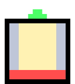

- **定員は8人:** カゴの下のゲージが乗っている人数で、満員になると赤くなります。満員のカゴは乗り場の呼び出しでは停まらず、乗れなかった人は次のカゴを待ちます。
- **進行方向:** カゴの上の緑の ▲▼ が進行方向です。カゴは進んでいる方向の先に呼び出しがある限り進み続け、途中の呼ばれた階に寄ります（集合制御）。待っている人は、行きたい方向へ進むカゴにだけ乗ります。
- **複数のカゴ（群管理）:** 1本のシャフトに4台までカゴを置けます。乗り場の呼び出しは、到着までの手間（距離・進行方向・停まる予定の数・混み具合）が一番小さいカゴに割り当てられます。朝のラッシュでは、1台だと10時過ぎまでかかる出勤が、4台なら9時半ごろに終わります。
- **カーソル:** シャフトにカーソルを合わせると「カゴ4台: 5/8・0/8・2/8・0/8人」のように各カゴの人数が出ます。待機階や稼働時間帯を決めていると、それも出ます。
- **待機階（ホーム）:** 「待機階を設定」でシャフトの階をクリックすると、呼び出しがないときカゴがその階に戻ります。朝のラッシュ前に1階に戻しておくと、出勤の人をすぐ運べます。
- **稼働時間帯:** 「稼働時間帯」でシャフトをクリックすると、終日 → 6時〜24時 → 8時〜20時 と切り替わります。時間帯の外ではカゴが止まり、待機階に戻ります。人はそのシャフトを通れなくなるので、階段やほかのシャフトの用意を忘れずに。
- **大型エレベーター:** 青いカゴで、横2マスを使います。全部の階に停まり、標準の1.5倍の速さで定員は16人です。急行は1階とスカイロビーにしか停まらないので、**中くらいの階の混雑**には大型が向きます。人は待ち時間の短いエレベーターを選ぶので、大型があるとそちらに集まります。
- **急行エレベーター:** 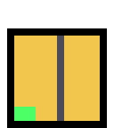 金色のカゴです。1階とスカイロビーの階だけに停まり、標準の3倍の速さで、定員は20人です。高い階へは「1階 →（急行）→ 15階のスカイロビー →（標準）→ 目的の階」と乗り換えるのが速くなります。途中の階のシャフトにカーソルを合わせると「この階には停まりません」と出ます。

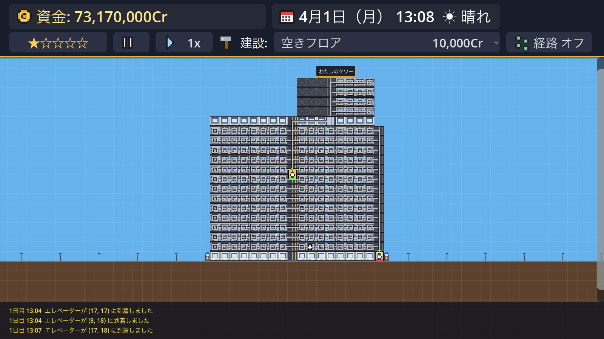

### お金（毎日の決算）

お金の単位は **Cr（クレジット）** です。ゲームの中だけのお金なので、実際の円の感覚とは切り離して考えてください（例: オフィスの撤去費用 40,000Cr）。単位は `scripts/main.gd` の `CURRENCY` 1か所で決めています。

毎日0時に前日の分を計算し、資金に反映します。結果は下部バーのメッセージと、資金の横の「（前日 +○○Cr）」でわかります。

| 収入 | 支出 |
|---|---|
| オフィスの賃料（1マス1日 小1.1万Cr・普通1万Cr・大0.9万Cr。休日も入る） | 維持費（エレベーター・カゴ・設備・店） |
| ホテルの宿泊料（チェックアウトした日） | ゴミの外部委託費（ゴミ処理場で処理しきれない分、1につき1,000Cr） |
| 飲食店の売上 | |
| 住宅の販売収入（入居したとき1回だけ） | |
| 結婚式場・イベントホールの料金 | |
| 評価ボーナス（★に応じて賃料と宿泊料に上乗せ） | |

ゴミは、出勤があったオフィス1マスにつき1、チェックアウトした客室1室につき1、入居済みの住宅1戸につき1、飲食店の客・会場の来客10人につき1出ます。

### ビルの評価（★）

毎日の決算のときに条件を満たしていれば★が1つ上がります（下がることはありません）。★が1つ上がるごとに、賃料と宿泊料に25%の評価ボーナスが付きます（昇格した翌日の決算から）。

| 評価 | 条件 |
|---|---|
| ★1 | 最初の評価 |
| ★2 | 人口50以上、警備室がある |
| ★3 | 人口120以上、メディカルセンターとゴミ処理場がある |
| ★4 | 人口250以上、地下鉄駅がある |

**人口** = 通勤できる社員の数 + 客室の定員 + 住宅の入居者の数。下部バーの左端に、今の評価と次の★に足りないものが出ます。

---

## ファイル構成

UIやゲームの仕組みはすべてコード（GDScript）で作っています（コードファースト）。エディタで作ったのは `scenes/main.tscn`（タイルマップとカメラ）だけです。

```
ProjectTower/
├── README.md / Tasks.md / Claude.md   … このファイル・タスク一覧・AIアシスタント向けのルール
├── project.godot / icon.svg           … Godot のプロジェクト設定とアイコン
├── scenes/     main.tscn               … メインのシーン（タイルマップとカメラ）
├── scripts/
│   ├── main.gd                         … ゲーム全体
│   ├── systems/                        … ゲームの仕組み（時計・エレベーター・テナント・お金など）
│   ├── actors/                         … 動くもの（人・エレベーターのカゴ）
│   └── view/                           … 見た目と操作（ドット絵・背景・明かり・カメラ）
├── assets/     stairs.svg              … シーンのタイルの元画像（起動時にドット絵に差し替える）
├── docs/       仕様書などのドキュメントと、README の画像（images/）
├── tests/      画面確認テスト
└── tools/      README の画像を作るスクリプト
```

| ファイル | 役割 |
|---|---|
| `scripts/main.gd` | ゲーム全体。建物の定義（`BUILDINGS`、建てられる階の決まり）、建設・撤去、UI、移動ルールと経路探索（ダイクストラ法） |
| `scripts/systems/game_clock.gd` | 時計・曜日、空の色、太陽と月 |
| `scripts/systems/audio_system.gd` | 効果音とBGM（波形をコードで作る） |
| `scripts/view/effects.gd` | 建設・撤去・お金の演出 |
| `scripts/view/ui.gd` | 画面（上下のバー・建設メニュー・操作説明・グラフ・吹き出し・タイトル画面）の組み立てと更新 |
| `scripts/systems/buildings.gd` | 建物の表（名前・値段・大きさ・建てられる階）と、建設・撤去のルール |
| `scripts/systems/pathfinding.gd` | 移動ルール（歩く・階段・エスカレーター・エレベーター）と経路探索 |
| `scripts/systems/elevator_system.gd` | シャフトとカゴの管理、カゴの追加、群管理 |
| `scripts/systems/commute_system.gd` | 社員の出勤・退社 |
| `scripts/systems/commerce_system.gd` | 飲食店・ファストフードの昼食 |
| `scripts/systems/hotel_system.gd` | ホテルの客室・宿泊客・清掃員 |
| `scripts/systems/housing_system.gd` | 住宅と入居者の家族 |
| `scripts/systems/event_system.gd` | 結婚式場・イベントホールの来客 |
| `scripts/systems/economy_system.gd` | 毎日の決算（収入・維持費・ゴミ） |
| `scripts/systems/rating_system.gd` | ビルの評価（★） |
| `scripts/systems/tenant_system.gd` | オフィス・客室・住宅の評価（良い・普通・悪い）と、退去・入居 |
| `scripts/actors/resident.gd` | 人（歩く・エレベーターを待つ・乗る、ストレス、ドット絵） |
| `scripts/actors/elevator_car.gd` | エレベーターのカゴ（集合制御・定員・手間の見積もり） |
| `scripts/view/pixel_art.gd` | 建物のドット絵（文字で描いた絵と色の表） |
| `scripts/view/grid_overlay.gd` | マス目・枠線・カーソル表示、空・星・太陽と月・街灯の柱・土の背景 |
| `scripts/view/lighting.gd` | 夜の建物の暗さと部屋の明かり、街灯・入口の照明 |
| `scripts/view/camera_controller.gd` | カメラ（スクロール・ズーム） |
| `tests/screenshot_test.gd` | 画面確認テスト（クリック操作を再現して確かめ、スクリーンショットを保存） |
| `tools/generate_readme_images.gd` | README の画像を作るスクリプト |

## 配布（書き出し）

ほかの人に遊んでもらうときは、macOS や Windows 向けに書き出します。書き出しの設定は [export_presets.cfg](export_presets.cfg) に入っています（`docs/`・`tools/`・`tests/` は含めません）。

1. **エクスポートテンプレートを入れる**（初回だけ）
   Godot エディタの「エディター > エクスポートテンプレートの管理」からダウンロードします（約1GB）。
2. **書き出す**

```bash
godot --headless --path . --export-release "macOS" build/ProjectTower.app
```

```bash
godot --headless --path . --export-release "Windows Desktop" build/ProjectTower.exe
```

書き出したものは `build/` に入ります（`.gitignore` 済み）。macOS の `.app` を配るときは署名や公証が必要になることがあります。

## 開発の進め方

- [docs/Project_Overview.md](docs/Project_Overview.md): ゲームのコンセプトと登場アイテム
- [docs/Game_Spec.md](docs/Game_Spec.md): 目標とするゲームの仕様と、今の実装の状況（実装済み・一部・未実装）
- [Tasks.md](Tasks.md): 開発のフェーズとタスク（完了したものにチェック）
- [docs/Tech_Stack.md](docs/Tech_Stack.md): 技術選定
- [Claude.md](Claude.md): AIアシスタントに開発を依頼するときのルール
